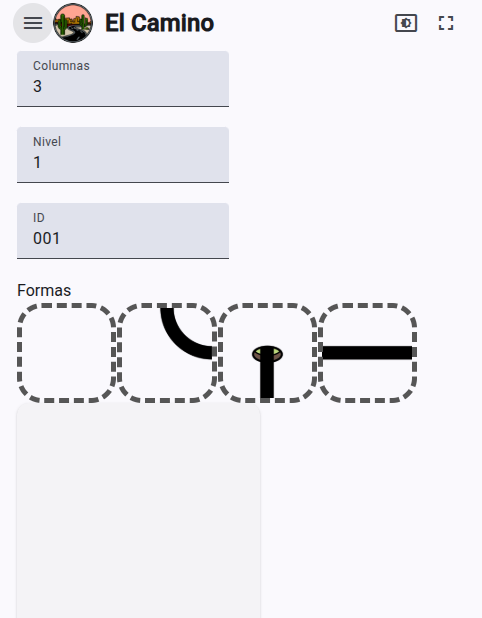

# El Camino


**El Camino** es un juego de rompecabezas interactivo que desafía a los jugadores a resolver niveles mediante la rotación y colocación correcta de piezas en un tablero. Cada nivel presenta un conjunto de bloques con diferentes formas y orientaciones, como curvas, líneas y extremos, que deben ser alineados correctamente para completar el camino.
<p align="center">
)&nbsp; &nbsp; &nbsp; &nbsp;
>
</p>


**El Camino** es un proyecto desarrollado con Angular v19 que permite a los usuarios construir y resolver caminos utilizando piezas interactivas. Este proyecto incluye funcionalidades como arrastrar y soltar, rotación de piezas y niveles dinámicos.

## Características

- **Interfaz interactiva**: Arrastra y suelta piezas para construir caminos.
- **Rotación de piezas**: Haz clic en las piezas para rotarlas y ajustarlas al camino.
- **Gestión de niveles**: Crea, edita y selecciona niveles personalizados.
- **Diseño responsivo**: Compatible con dispositivos móviles y de escritorio.
- **Temas**: Cambia entre temas claro, oscuro y sistema.


## Dinámica del juego:
Rotación de piezas: Los jugadores pueden hacer clic en las piezas para rotarlas y alinearlas con las demás. Cada tipo de pieza tiene restricciones específicas en cuanto a sus rotaciones posibles.
Resolución de niveles: El objetivo es conectar todas las piezas del tablero de manera correcta, asegurándose de que las conexiones entre ellas sean coherentes.
Progresión: Los niveles aumentan en dificultad, introduciendo más piezas y configuraciones más complejas.
Indicadores visuales: Las piezas correctamente alineadas se marcan como "correctas", ayudando al jugador a identificar su progreso.
Interfaz intuitiva: El diseño del juego incluye animaciones suaves y una experiencia visual atractiva, con soporte para temas claros y oscuros.
El juego combina estrategia, lógica y paciencia, ofreciendo una experiencia desafiante y entretenida para los amantes de los rompecabezas. ¿Podrás completar todos los niveles y dominar El Camino?


## Instalación

1. Clona este repositorio:
   ```bash
   git clone https://github.com/tu-usuario/el-camino.git
   cd el-camino

2. Instala las dependencias:
npm install
3. Inicia el servidor de desarrollo:
npm start
4. Abre tu navegador en http://localhost:4200/.

## Scripts disponibles
npm start: Inicia el servidor de desarrollo.
npm run build: Genera una versión optimizada para producción.
npm test: Ejecuta las pruebas unitarias.
npm run pwa: Genera los recursos necesarios para PWA.
## Construcción
Para construir el proyecto, ejecuta:

Los artefactos de construcción se almacenarán en el directorio dist/.

## Pruebas
Ejecuta las pruebas unitarias con:

## Despliegue
Este proyecto está configurado para ser desplegado en Firebase Hosting. Para desplegarlo, ejecuta:

## Tecnologías utilizadas
Angular: Framework principal para la construcción de la aplicación (versión 15.2.0).
Angular Material: Componentes de interfaz de usuario (versión 15.2.0).
TailwindCSS: Estilización (versión 3.3.0).
Firebase: Backend para hosting y base de datos (versión 11.0.0).
RxJS: Manejo de flujos reactivos (versión 7.8.0).
## Contribuciones
Las contribuciones son bienvenidas. Por favor, abre un issue o envía un pull request para sugerir mejoras o reportar errores.

## Licencia
2025 © Pete Sahatt. Todos los derechos reservados.

## Contacto
GitHub
Instagram
X (Twitter)
